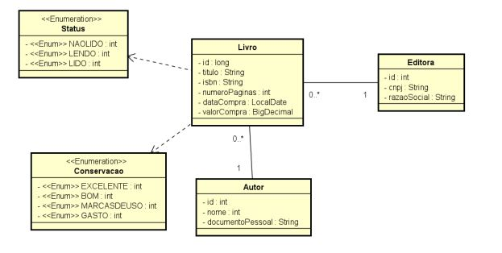

# 📚 *Projeto Biblioteca Java com Spring*

## 📌 Sobre o Projeto
Este projeto feito na linguagem Java com o framework Spring, contendo operações CRUD e validações essenciais. 

## 🚀 Funcionalidades

### 🔹 Métodos HTTP Implementados para todas classes
- *GET*
- *POST*
- *PUT*
- *DELETE*

### ✅ Validações Implementadas
- **Deletar Editora**: Editora não pode ser deletada com um livro vinculado
- **Livro**: Impede a inserção de ISBN  repetidos
- **Deletar Autor**: Autor não pode ser deletado com um livro vinculado
- **Campos nulos para todas as classes**: Bloqueia requisições com valores ausentes
- **Campos vazios para todas as classes**: Garante que os dados obrigatórios sejam preenchidos

### 🗄 Banco de Dados Suportados
- *H2* (banco em memória para testes)
- *PostgreSQL* (banco de produção)

### ⚠ Tratamento de Erros
- Retorno de mensagens amigáveis para o usuário
- Padronização de respostas HTTP para erros comuns

---
